# 🏗️ Fresher Food Delivery - System Architecture Diagrams

Tài liệu mô tả kiến trúc toàn bộ hệ thống bằng Mermaid diagrams.

---

## 1. 📐 System Architecture Overview

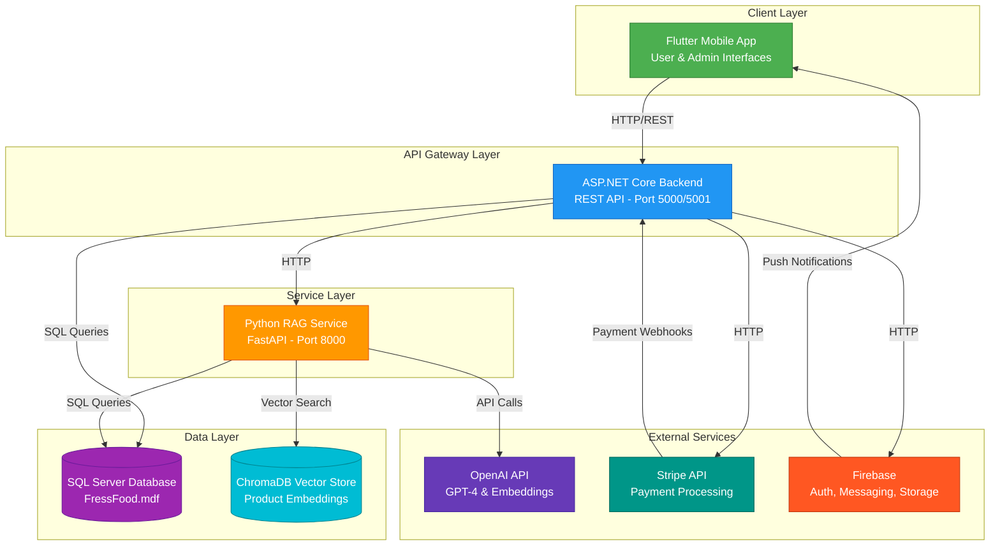

---

## 2. 🔄 User Flow - Order Processing

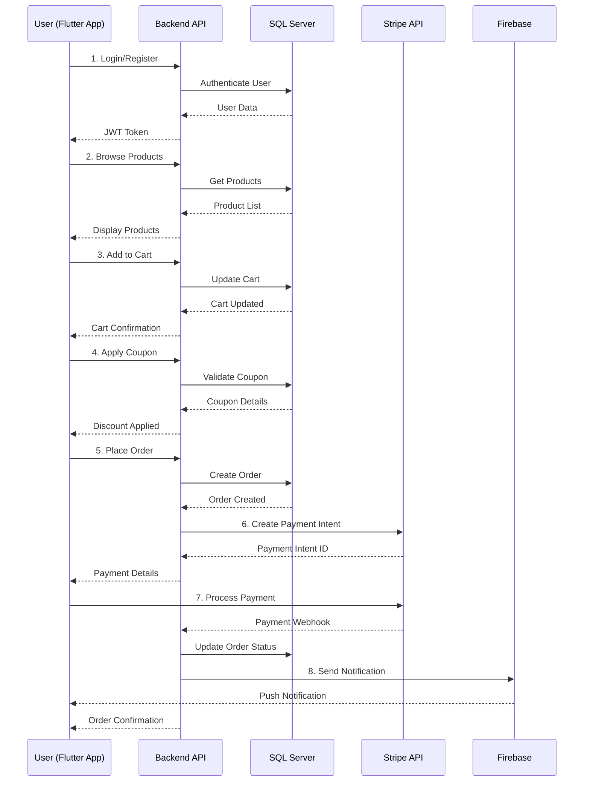

---

## 3. 🤖 AI Chat Flow with RAG

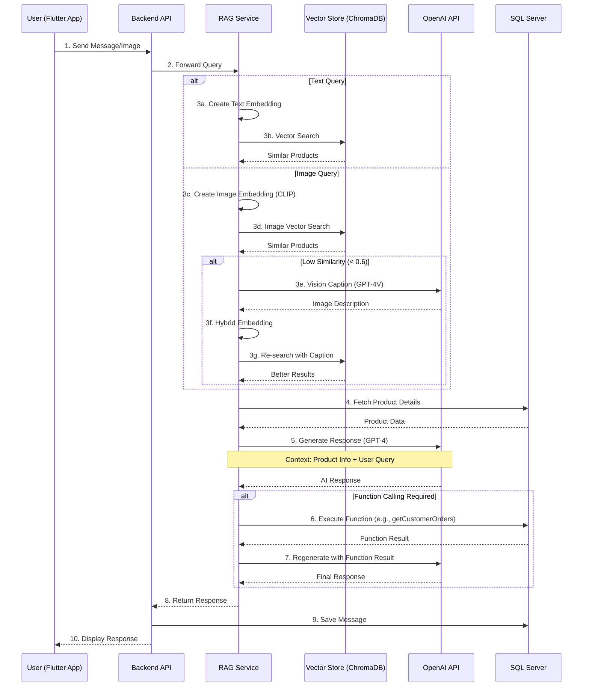

---

## 4. 🗄️ Database Schema

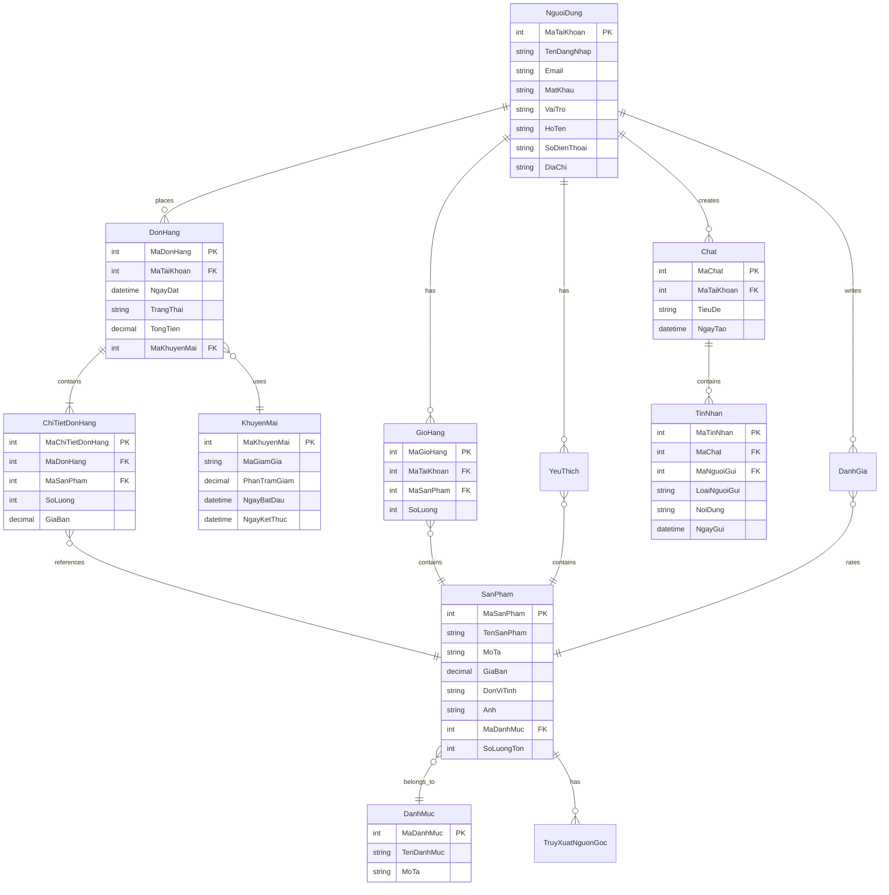

---

## 5. 📱 Flutter App Structure

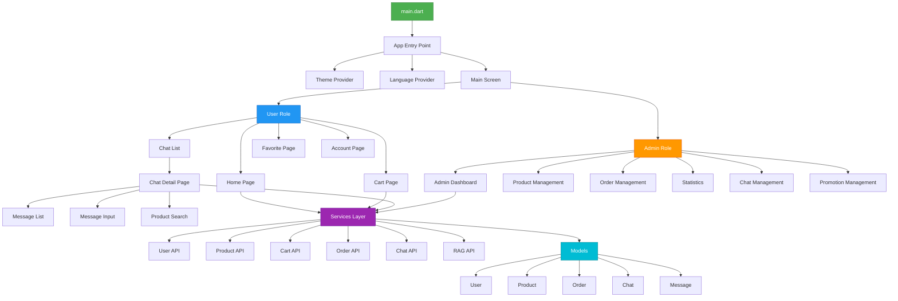

---

## 6. 🔧 Backend API Structure

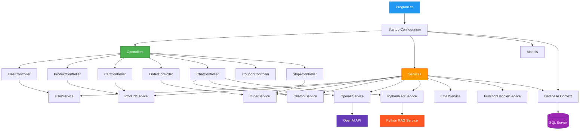

---

## 7. 🐍 RAG Service Architecture

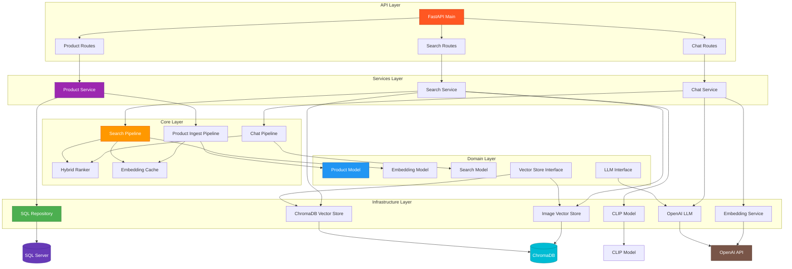

---

## 8. 🔍 Product Search Flow

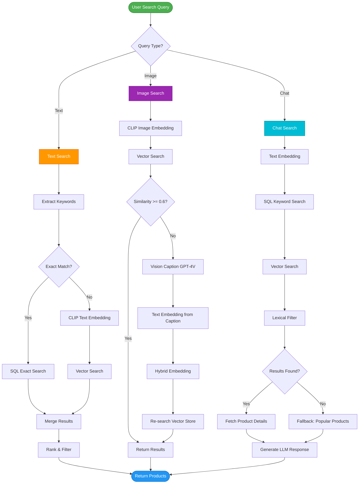

---

## 9. 💳 Payment Flow

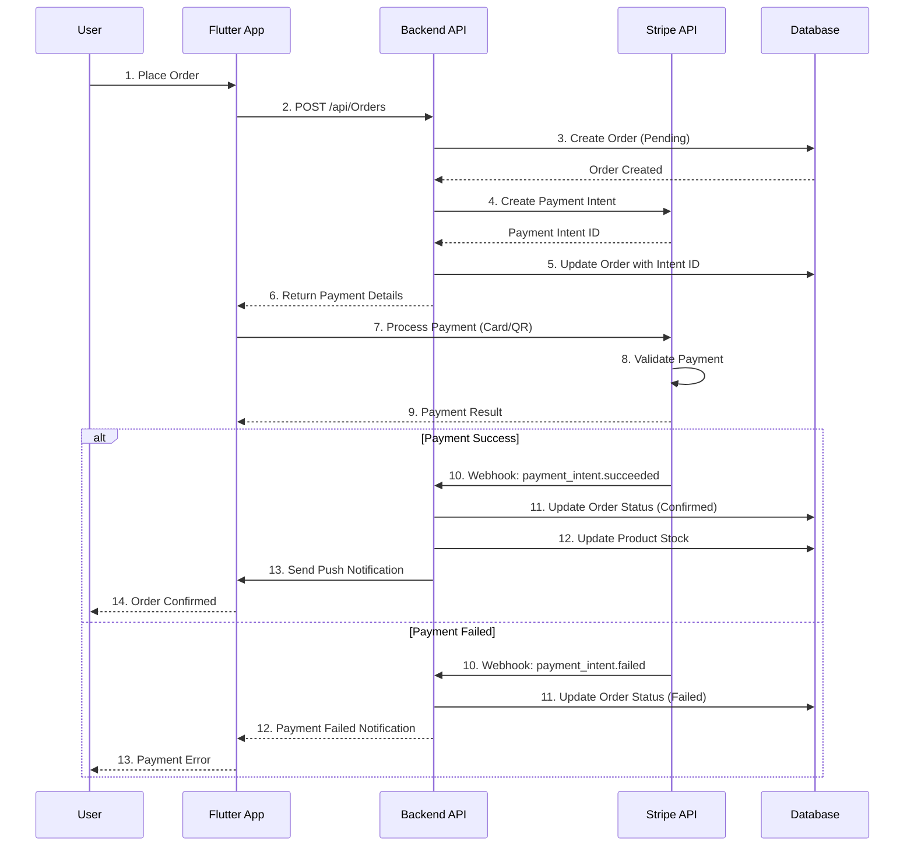

---

## 10. 📊 State Management Flow (Flutter)

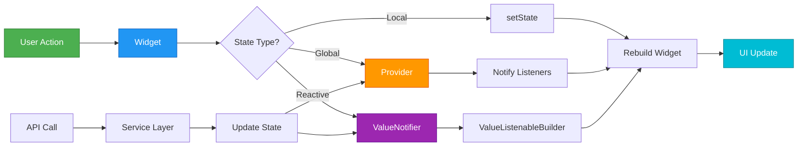

---

## 11. 🔐 Authentication & Authorization Flow

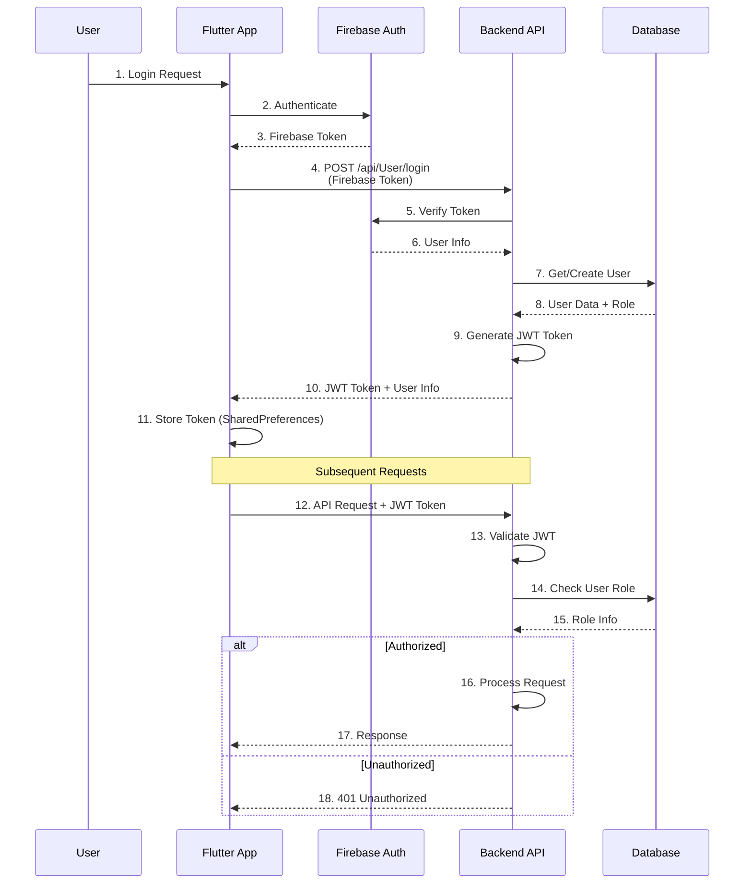

---

## 12. 📦 Deployment Architecture

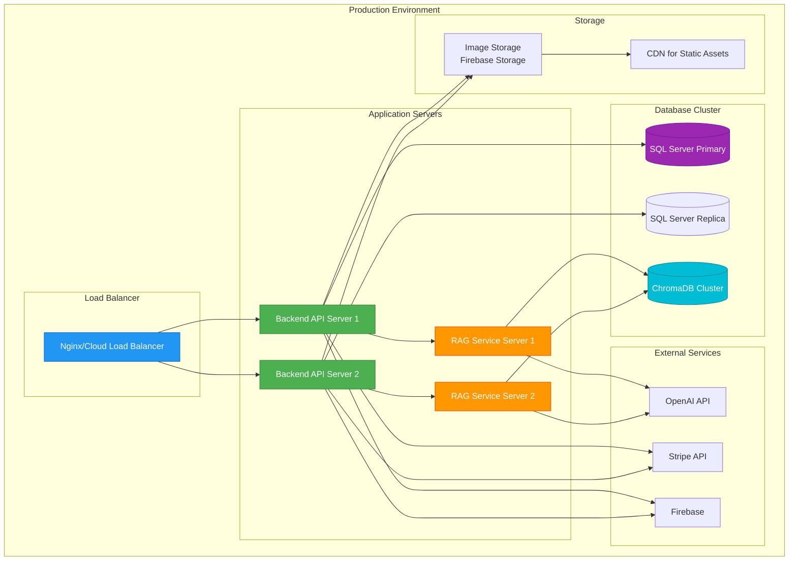

---

## 📝 Notes

- **Ports:**
  - Flutter App: Mobile (no fixed port)
  - Backend API: 5000 (HTTP), 5001 (HTTPS)
  - RAG Service: 8000 (HTTP)
  - SQL Server: 1433 (default)
  - ChromaDB: Embedded (no external port)

- **Technologies:**
  - Frontend: Flutter 3.0+, Dart 3.0+
  - Backend: ASP.NET Core 8.0, C#
  - RAG Service: Python 3.8+, FastAPI
  - Database: SQL Server
  - Vector Store: ChromaDB
  - AI: OpenAI GPT-4, Embeddings, CLIP

- **Key Features:**
  - Real-time chat with RAG
  - Image-to-image product search
  - Function calling for database queries
  - Payment processing with Stripe
  - Push notifications with Firebase
  - Multi-language support (Vi/En)
  - Dark/Light theme

---

**Generated:** 2026-02-02  
**Version:** 1.0.0

